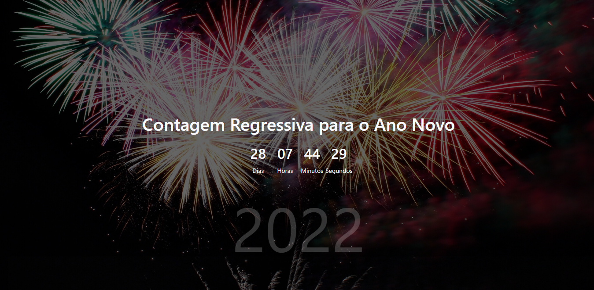

<h1 align="center">Contagem Regressiva para o Ano Novo</h1>

    <a href="#tecnologias">Tecnologias</a>&nbsp;&nbsp;&nbsp;|&nbsp;&nbsp;&nbsp;
    <a href="#projeto">Projeto</a>&nbsp;&nbsp;&nbsp;|&nbsp;&nbsp;&nbsp;
    <a href="#layout">Layout</a>&nbsp;&nbsp;&nbsp;|&nbsp;&nbsp;&nbsp;
    <a href="#licença">Licença</a>

    
    </img>

    

<h2 id="tecnologias">Tecnologias</h2>

Esse projeto foi Desenvolvido com as seguintes tecnologias:

- HTML
- CSS
- JavaScript

<h2 id="projeto">Projeto</h2>

Contagem regressiva para o ano novo, projeto feito com javaScript puro, 
criando elementos e trabalhando com a função Date.

<h2 id="licença">Licença</h2>

Esse projeto está sob a licença MIT. Veja o arquivo <a href="https://github.com/William-AViana/contagem-regressiva-novo-ano/blob/main/LICENSE">LICENSE</a> para mais detalhes.

<h2>☁️ Deploy:</h2>
https://william-aviana.github.io/contagem-regressiva-novo-ano/
